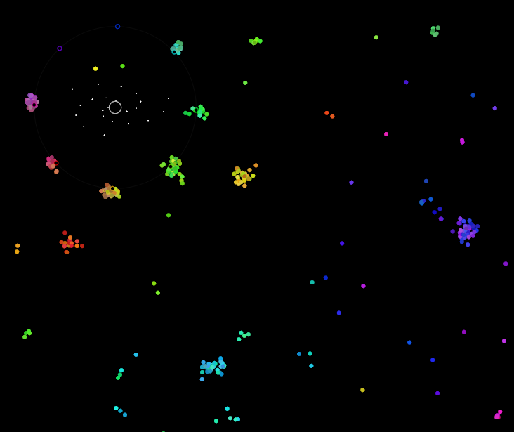

# Core of Color
This game is made for `Ludum Dare 49 - Unstable` game jam.
## Screenshot

## Goals of the game
* Grow you core.
* To do this use your orbiting dots to catch free dots of the same color.
* Dots of the same color attract each other, dots of different colors repel each other.
* Core will drain saturatuin from free dots around your orbiting dots.
* As core grows you'll get more orbiting dots with another colors.
* Relax and have fun.
## Controls
Arrow keys or WASD.
## How to play
* [Play web version](https://qthree.github.io/core_of_color/)
* [Download Windows version from Releases](https://github.com/qthree/core_of_color/releases)
* [Install Rust](https://rustup.rs/), clone this repo, `cargo run --release`
